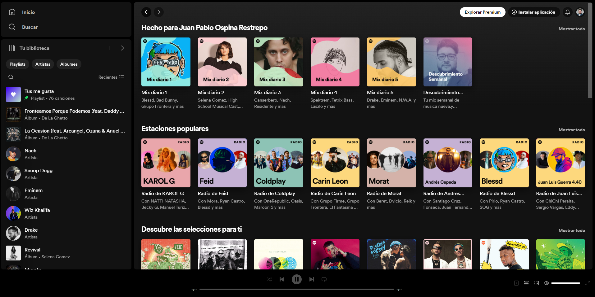

# Proyecto Clon de Spotify

¡Bienvenido/a a nuestro proyecto!

## Descripción

Este proyecto es un clon de Spotify que busca replicar algunas de las funcionalidades básicas de la popular app de música.
Se a implementado la sección principal de la web lo que es el miniMenu - zona de exploración/home - reproductor(Visual no funcional)
Adicionalmente tiene algunas interacciones como animaciones interactividad con algunos hover y los scroll en los componentes para no afectar toda la web, tambien tiene algunos stylos intentando mantener la esencia original

## Tecnologías Utilizadas

- HTML
- CSS
- JavaScript
- React

## Librerías

- React icons

## Herramientas Utilizadas

- Sistema Operativo: Ubuntu y Windows Subsystem for Linux (WSL)

## Empaquetador

Utilizamos Vite como empaquetador para el desarrollo y construcción del proyecto.

## Instalación

1. Clona el repositorio a tu máquina local.
2. Ejecuta `pnpm install` o `npm install` para instalar las dependencias.
3. Utiliza `pnpm start` o `npm start` para iniciar el servidor de desarrollo y visualizar el proyecto.
4. Para construir el proyecto, ejecuta `pnpm build` o `npm build`.
5. Si deseas visualizar una versión previa del proyecto en un entorno de preproducción, ejecuta `pnpm serve` o `npm serve`.

## Archivo Principal

El archivo principal del proyecto es `App.jsx`, donde se encuentra la estructura principal de la aplicación.

## Contribución

¡Estamos abiertos a contribuciones! Si deseas participar en el desarrollo de este proyecto, por favor sigue los siguientes pasos:

1. Haz un fork del repositorio.
2. Realiza tus cambios en una nueva rama (`git checkout -b feature/nueva-funcionalidad`).
3. Realiza un commit de tus cambios (`git commit -am 'Agrega nueva funcionalidad'`).
4. Haz push a la rama (`git push origin feature/nueva-funcionalidad`).
5. Envía un pull request.

## Contacto

Si tienes alguna pregunta o sugerencia sobre el proyecto, no dudes en ponerte en contacto con nosotros.

## Licencia

Este proyecto está bajo la Licencia [MIT](./LICENSE).